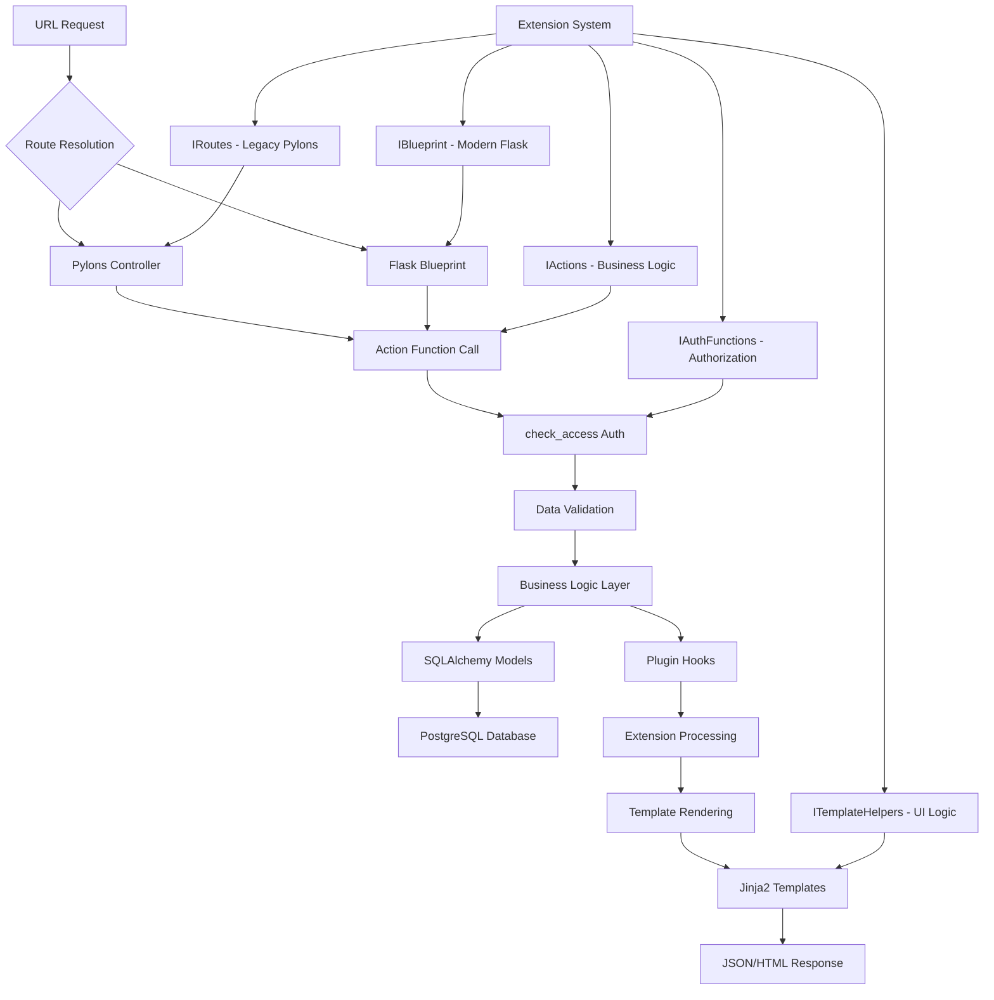
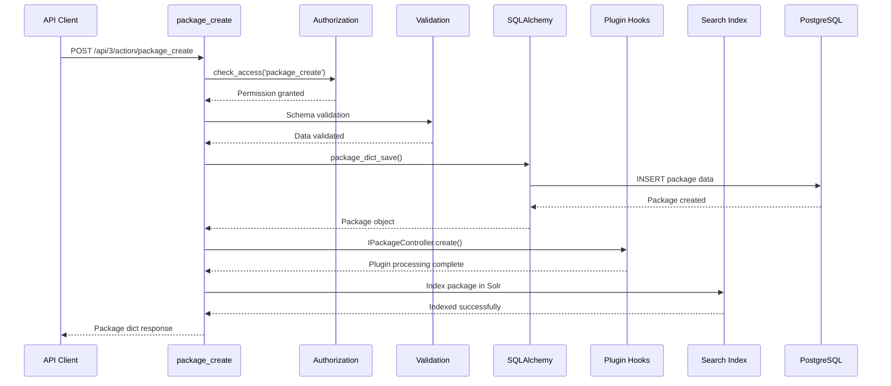

# CKAN Architecture Diagrams

## CKAN Request Flow & Extension System Architecture

This diagram shows CKAN's dual routing architecture (legacy Pylons + modern Flask) and the comprehensive plugin interface system:



## Key Architecture Insights

### Dual Routing System
- **Legacy Pylons**: `IRoutes` interface with `before_map()` method
- **Modern Flask**: `IBlueprint` interface with `get_blueprint()` method
- **Coexistence**: Both systems run simultaneously during migration

### Extension Interface Categories
1. **Configuration**: IConfigurer - resource and template management
2. **Business Logic**: IActions - 400+ action functions extensible by plugins
3. **Authorization**: IAuthFunctions - custom permission rules
4. **User Interface**: ITemplateHelpers - template utilities and UI logic
5. **Data Validation**: IValidators - custom field validation rules
6. **Lifecycle Hooks**: IPackageController, IResourceController - dataset/resource events

### Request Flow Stages
1. **Route Resolution** - URL mapped to controller/blueprint
2. **Authentication** - User context and permissions established
3. **Authorization** - `check_access()` validates permissions
4. **Data Validation** - Input validation via plugin-extensible schemas
5. **Business Logic** - Action functions execute core operations
6. **Data Persistence** - SQLAlchemy models handle database operations
7. **Plugin Processing** - Extension hooks modify behavior
8. **Template Rendering** - Jinja2 templates generate responses

## Additional Diagrams

### Package Creation Flow


### Authorization System Flow
```mermaid
graph LR
    A[Request] --> B[User Context]
    B --> C[User Labels]
    B --> D[Dataset Labels]
    
    C --> E[public]
    C --> F[creator-{user_id}]
    C --> G[member-{org_id}]
    C --> H[collaborator-{dataset_id}]
    
    D --> I[public - active, not private]
    D --> J[creator-{creator_id}]
    D --> K[member-{owner_org}]
    D --> L[collaborator-{package_id}]
    
    E --> M[Permission Matrix]
    F --> M
    G --> M
    H --> M
    I --> M
    J --> M
    K --> M
    L --> M
    
    M --> N{Any Label Match?}
    N -->|Yes| O[Access Granted]
    N -->|No| P[Access Denied]
```

---

*These diagrams represent CKAN's current architecture as of the Day 1 archaeological analysis. They highlight both the legacy patterns that need modernization and the sophisticated plugin system that enables extensibility.* 